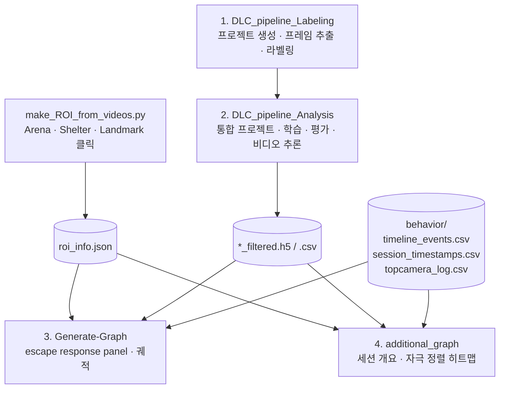

# DeepLabCut based Behavior Analysis Pipeline

DeepLabCut 자세 추정을 기반으로 마우스의 **회피(escape) 행동**을 정량화하는 분석 파이프라인입니다.

Arena·Shelter ROI 설정부터 DLC 라벨링·학습·추론, 그리고 자극(threat / optogenetics) 정렬 행동 지표와 논문용 그림 생성까지를 다룹니다. Fiber photometry(FIP) 신호가 있으면 행동 지표와 함께 분석하고, 없으면 **행동 지표만으로 자극 기준 분석**을 수행합니다.

---

## 파이프라인 흐름



`1 → 2`는 모델을 만드는 단계로 **처음 한 번만** 수행하고, 이후 새 영상이 생기면 `2`의 STEP 3(추론)부터 반복합니다. `3`과 `4`는 서로 독립적인 그림 생성 노트북이라 필요한 쪽만 쓰면 됩니다.

---

## 저장소 구성

```
├── make_ROI_from_videos.py            # ROI 설정 GUI (Arena/Shelter/Landmark → roi_info.json)
├── make_ROI_from_videos_설명.txt      # 위 스크립트 사용 설명서 + 트러블슈팅
└── DLC_pipeline/
    ├── 1.DLC_pipeline_Labeling_Github.ipynb   # 프로젝트 생성 · 프레임 추출 · napari 라벨링
    ├── 2.DLC_pipeline_Analysis_Github.ipynb   # 통합 프로젝트 · 학습 · 평가 · 추론
    ├── 3.Generate-Graph_Github.ipynb          # escape response panel · 궤적 그림
    └── 4_additional_graph_Github.ipynb        # 세션 개요 · 자극 정렬 히트맵
```

---

## 요구 환경

| 구성 요소 | 비고 |
|---|---|
| Python 3.10 | conda 환경 권장 |
| `deeplabcut` 3.x | PyTorch 엔진 사용 |
| `torch` (CUDA 빌드) | GPU 추론/학습. CPU만 있으면 `gputouse` 인자 제거 |
| `napari-deeplabcut` | 라벨링 GUI |
| `opencv-python`, `numpy`, `pandas`, `scipy`, `matplotlib` | 공통 |
| `tkinter` | 파일 선택 GUI (파이썬 기본 내장) |

```bash
conda create -n dlc python=3.10
conda activate dlc
pip install "deeplabcut[gui]" napari-deeplabcut opencv-python
# torch 는 CUDA 버전에 맞춰 https://pytorch.org 에서 설치
```

노트북 1의 첫 셀에서 설치 상태를 확인할 수 있습니다:

```python
print(deeplabcut.__version__, torch.__version__, torch.cuda.is_available())
```

> **주의** — 모든 노트북과 스크립트가 `tkinter` 파일 선택 창을 띄웁니다. 원격 세션이나 GUI 없는 환경에서는 동작하지 않습니다.

---

## 데이터 폴더 구조

노트북 4는 **세션 폴더 단위**로 동작하며, 아래 구조를 기대합니다.

```
<animal>_<YYYY-MM-DD_HH-MM-SS>/
├── roi_info.json                    # ROI 스크립트 산출물 (필수)
├── behavior/
│   ├── ..._timeline_events.csv      # 자극/이벤트 로그 (필수)
│   ├── ..._session_timestamps.csv   # 세션 start/save 시각 (권장)
│   └── ..._topcamera_log.csv        # 프레임별 타임스탬프 (필수)
├── behavior-videos/
│   ├── ..._topcamera.avi
│   └── ...DLC..._filtered.csv       # DLC 추론 결과 (필수)
├── fip/                             # Fiber photometry (선택 — 없으면 행동만 분석)
│   └── Raw_dFF_Data_ROI*.csv
└── opto/                            # optogenetics 자극 설정 (선택)
```

### 파일명 규칙 두 가지

수집 시기에 따라 `behavior/` 안의 파일명 규칙이 다릅니다. **내용은 동일하고 이름만 다릅니다.**

| | 구버전 | 신버전 |
|---|---|---|
| 카메라 로그 | `<animal>_topcamera_log_<timestamp>.csv` | `<sessionID>_topcamera_log.csv` |
| 이벤트 | `timeline_events.csv` | `<sessionID>_timeline_events.csv` |
| 세션 시각 | `session_timestamps.csv` | `<sessionID>_session_timestamps.csv` |

노트북 4는 두 규칙을 모두 인식합니다. 노트북 3의 다중 동물 모드는 `timeline_events.csv` / `session_timestamps*.csv`를 **구버전 이름으로만** 찾으므로, 신버전 데이터는 단일 동물 모드에서 파일을 직접 지정하세요.

---

## 입력 파일 규격

### `roi_info.json`

`make_ROI_from_videos.py`가 생성합니다.

```jsonc
{
  "arena_center":      [x, y],       // px
  "arena_radius":      float,        // px
  "arena_diameter_cm": 100.0,        // 스크립트에 하드코딩된 값
  "px_per_cm":         float,        // arena_radius * 2 / 100
  "shelter_points":    [[x, y], ...],// 시계방향 4점
  "shelter_center":    [x, y],
  "landmark1_center":  [x, y],       // 선택
  "landmark1_radius":  float,        // 선택
  "landmark2_center":  [x, y],       // 선택
  "landmark2_radius":  float         // 선택
}
```

> Arena 실제 지름이 100 cm가 아니면 `make_ROI_from_videos.py`의 `arena_diameter_cm` 값을 바꿔야 합니다. 이 값이 모든 cm 단위 지표(거리·속도)의 기준입니다.

### `timeline_events.csv`

UTF-8 BOM이 붙어 있으므로 `encoding='utf-8-sig'`로 읽습니다.

```csv
type,start_timestamp_s,end_timestamp_s,duration_s,frequency_Hz,event
span,58110.43078,58113.44203,3.011,20,Optogenetics
point,78953.124883,,,,Shelter Remove
```

- `start_timestamp_s`는 카메라 로그와 **같은 시계의 절대 시각**입니다. 별도 보정이 필요 없습니다.
- 이벤트 이름: `Threat`, `Optogenetics`, `Shelter Remove`, `Shelter Return`.
- opto 전용 세션에는 `Threat`가 없습니다. 노트북 4는 이 경우 자동으로 `Optogenetics`를 자극 기준으로 사용합니다.

### `session_timestamps.csv`

```csv
event,timestamp_s,local_time,duration_since_start_s
start,57278.721015,2026-08-10 15:54:38.721,
save,59489.623454,2026-08-10 16:31:29.623,2210.902
```

노트북 4는 `USE_SESSION_WINDOW = True`일 때 모든 데이터를 `start ~ save` 구간으로 자르고, 시간축 원점(0 s)을 `start`에 맞춥니다. **이 파일이 없으면 crop 없이 녹화 전체가 사용됩니다.**

### 카메라 로그

헤더 없는 3열 CSV입니다.

```csv
12811406,FRAME, 57274.648192
12811407,FRAME, 57274.6784896
```

`frame_id, type, timestamp_s` 순이며, `timestamp_s`가 `timeline_events.csv`와 같은 시계입니다.

---

## 사용법

### Step 0 — ROI 설정

```bash
python make_ROI_from_videos.py
```

영상과 저장 폴더를 고르면 영상 중간 프레임이 열립니다.

1. **Arena** 원주 8점 클릭 → 최소외접원으로 중심·반지름 계산
2. **Shelter** 모서리 4점 클릭 — **반드시 시계방향**. 지그재그로 찍으면 폴리곤이 꼬여 shelter 내부 판정이 틀어집니다.
3. **Landmark 1/2** 원주 4점 (선택, `ESC`로 건너뜀)

좌클릭 = 점 추가, 우클릭 = 되돌리기, `ESC` = 취소/건너뛰기. 자세한 내용은 [make_ROI_from_videos_설명.txt](make_ROI_from_videos_설명.txt)를 참고하세요.

### Step 1 — 라벨링 (`1.DLC_pipeline_Labeling`)

프로젝트 생성 → `config.yaml` 자동 설정 → 프레임 추출 → napari 라벨링 → 라벨 확인.

Body parts는 7개이며 아래 순서로 클릭합니다:

```
nose → R_ear → L_ear → neck → body_center → tail_base → tail_end
```

Skeleton: `nose–R_ear`, `nose–L_ear`, `nose–neck`, `neck–body_center`, `body_center–tail_base`, `tail_base–tail_end`

> 프로젝트명과 실험자명은 이후 단계에서 계속 참조되므로 **한 번 정하면 바꾸지 마세요.**

### Step 2 — 학습 및 추론 (`2.DLC_pipeline_Analysis`)

| 단계 | 내용 | 실행 시점 |
|---|---|---|
| STEP 0 | 통합 프로젝트 생성 | 처음 한 번 |
| STEP 1 | 기존 라벨링 폴더 흡수 (scorer 이름 자동 통일) | 라벨 추가 시 |
| STEP 2 | 학습 데이터셋 생성 → 학습 → 평가 | 재학습 시 |
| STEP 3 | **새 비디오 분석** | 새 영상마다 |

STEP 3은 추론(`analyze_videos`) → 중앙값 필터(`filterpredictions`) → 라벨 오버레이 영상(`create_labeled_video`) 순으로 진행되며, `_filtered.h5` / `_filtered.csv`를 만듭니다. 이 파일이 노트북 3·4의 입력입니다.

추론 셀은 `pytorch_config.yaml`의 `inference.autocast`를 자동으로 켜서 FP16으로 추론합니다. 이미 분석된 영상은 자동으로 건너뜁니다.

필요하면 STEP 4에서 아웃라이어 프레임 추출 → 재라벨링 → 데이터셋 병합 → 재학습으로 모델을 개선할 수 있습니다.

### Step 3 — Escape response panel (`3.Generate-Graph`)

단일 동물 모드는 GUI에서 `H5 / ROI JSON / Camera Log / Event Log / Session TS / 출력 폴더 / Animal ID`를 직접 지정하고, 다중 동물 모드는 동물 폴더를 반복 선택해 자동 탐색합니다.

생성되는 패널:

| 패널 | 내용 |
|---|---|
| ax1 | Arena overhead — 궤적 + head/movement 방향 화살표 + landmark |
| ax2 | Shelter까지의 정규화 거리 궤적 |
| ax3 | Speed (mean ± SEM) |
| ax4 | Normalized distance (mean ± SEM) |
| ax5 | cos(goal angle) (mean ± SEM) |

Shelter 유무(`Shelter O` / `Shelter X`)로 trial을 나눠 각각, 그리고 전체에 대해 그림을 저장합니다. 3D 궤적/점유도 그림도 함께 생성됩니다.

### Step 4 — 세션 개요 및 자극 정렬 (`4_additional_graph`)

세션 폴더를 여러 개 선택하고, 사용할 FIP 파장(470 nm / 565 nm)과 신호 이름을 GUI에서 지정합니다. **FIP가 없으면 자동으로 행동 지표만 사용**합니다.

| 산출물 | x축 원점 | 범위 |
|---|---|---|
| `*_fig3e` — 세션 전체 개요 | 세션 시작 | `0 ~ session_duration` |
| `*_fig3e_zoom01~06` — 자극 구간 확대 | 세션 시작 | 자극 ±20 s |
| `*_opto_all` — 전체 opto 자극 나열 | 자극 onset | −20 ~ +20 s |
| `*_threataligned_heatmap` — 자극 정렬 히트맵 | 자극 onset | −5 ~ +15 s |
| `*_shelterentry_heatmap` — shelter 진입 정렬 (FIP 전용) | shelter 진입 | −5 ~ +10 s |

각 그림은 `.pdf`와 `.png`로 함께 저장됩니다.

---

## 주요 파라미터

노트북 4의 `BEHAV` 딕셔너리에서 행동 판정 기준을 조정합니다.

| 항목 | 기본값 | 의미 |
|---|---|---|
| `rest_thr` | 2.0 cm/s | 이 미만이면 정지 |
| `move_thr` | 3.0 cm/s | 이 초과면 이동 |
| `shelter_r` | 8.0 cm | 거리 기반 shelter 판정 반경 (폴리곤 없을 때 fallback) |
| `shelter_dur` | 1.0 s | shelter 체류로 인정할 최소 시간 |

추적 품질 관련:

| 항목 | 기본값 | 의미 |
|---|---|---|
| `DLC_LIKELI_THR` | 0.5 | likelihood 미만 프레임은 보간 |
| `SPD_JUMP_THR` | 500 cm/s | 초과 시 추적 튐으로 보고 보간 (최대 3회 반복) |
| `DIST_SMOOTH_N` | 3 프레임 | 거리 계산용 위치 스무딩 |
| `SPEED_WIN` | 5 프레임 | 속도 계산 displacement 윈도우 |

---

## 트러블슈팅

**`ModuleNotFoundError: No module named 'cv2'` / `'numpy'`**
`python` 명령이 의도한 환경을 가리키지 않는 경우가 대부분입니다. 전체 경로로 실행하세요.

```bash
where python                       # 어떤 python이 잡히는지 확인
C:\path\to\envs\dlc\python.exe make_ROI_from_videos.py
```

VS Code에서는 `Ctrl+Shift+P` → `Python: Select Interpreter`로 환경을 지정합니다. 워크스페이스에 이미 선택된 인터프리터가 저장되어 있으면 `python.defaultInterpreterPath` 설정보다 **그쪽이 우선**하므로, 반드시 이 메뉴로 바꿔야 합니다.

**`python`을 실행해도 반응이 없거나 "Python"만 출력됨**
Windows Store 스텁입니다. `설정 → 앱 → 앱 실행 별칭`에서 `python.exe`를 끄세요.

**`카메라 로그 없음` 또는 `timeline_events.csv 없음`**
파일명 규칙이 달라 탐색에 실패한 경우입니다. 위 [파일명 규칙 두 가지](#파일명-규칙-두-가지)를 확인하세요.

**`astype(float)` 관련 오류로 로딩 실패**
Camera Log 자리에 `behavior-videos/`의 DLC 출력 CSV를 잘못 지정한 경우입니다. 카메라 로그는 `behavior/` 안의 헤더 없는 3열 CSV입니다.

**`FIP 없음` 으로 세션이 로드되지 않음**
`fip/` 폴더가 비어 있어도 정상 동작해야 합니다. 그래도 실패하면 노트북이 최신 버전인지 확인하세요.

**Symlink creation impossible (exFat architecture?)**
exFAT 드라이브에서는 심볼릭 링크 대신 영상이 복사됩니다. 동작에는 문제가 없지만 디스크를 그만큼 더 씁니다.

---

## 알려진 제약

- 모든 GUI가 `tkinter`/OpenCV 창에 의존하므로 헤드리스 환경에서는 실행할 수 없습니다.
- Arena 지름은 `make_ROI_from_videos.py`에 100 cm로 하드코딩되어 있습니다.
- 노트북 3의 다중 동물 모드는 구버전 파일명만 인식합니다.
- 노트북 3·4는 단일 동물(single-animal) DLC 프로젝트를 전제로 합니다.
- 자극이 세션 시작 5초 이내 또는 종료 15초 이내에 있으면, 자극 정렬 히트맵에서 해당 trial이 제외되지만 제목의 `n`은 여전히 전체 이벤트 수로 표시됩니다.

---

## 참조

플롯 구성은 Bhatt et al., *Nature Neuroscience* (2024)의 escape response panel 스타일을 따릅니다.
